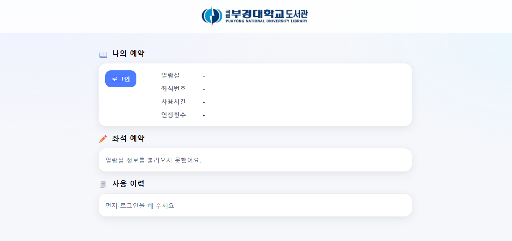

# 도서관 좌석 예약 시스템

GDGoC 동아리 Beginner 2팀에서 진행하는 **도서관 좌석 예약 웹 서비스 프로젝트** 입니다.

본 프로젝트는 비기너 과정 동안 학습한  
프론트엔드와 백엔드 기초 기술을 바탕으로,  
실제 사용 시나리오를 가진 웹 서비스를 구현하는 것을 목표로 합니다.

---

## 프로젝트 개요



사용자가 웹을 통해 좌석 현황을 확인하고 예약할 수 있는  
간단한 좌석 예약 시스템을 기획하였습니다.

본 프로젝트는 다음과 같은 흐름을 가집니다.

- 사용자 로그인
- 메인 화면에서 사용자 정보 및 좌석 상태 확인
- 좌석 예약 및 예약 상태 관리

---

## 개발 기간

- 2026년 1월 ~ 2026년 2월

GDGoC 동아리 Beginner 일정에 맞추어 약 2개월간 기획부터 설계, 개발을 진행합니다.


## 주요 기능

- 회원가입 및 로그인
- 메인 화면에서 사용자 예약 정보 확인
- 도서관 좌석 조회
- 좌석 예약 및 반납

---

## 기술 스택

### Frontend
- HTML
- CSS
- JavaScript
- React  
- Vite  

### Backend
- Java
- Spring 


### Design
- Figma  
  - UI 설계 및 사용자 흐름 정의


### Version Control
- Git
- GitHub

---

## 실행 방법

### 사전 준비

- Git
- Node.js (LTS 권장) / npm
- Java 17

#### OS별 참고
- Windows: PowerShell 또는 Git Bash 사용 가능  
  - Gradle 실행은 `.\gradlew.bat` (PowerShell), `./gradlew` (Git Bash) 둘 다 가능
- macOS / Linux: 터미널에서 `./gradlew` 사용  
  - 권한 문제가 있으면 `chmod +x gradlew` 필요

### 프로젝트 클론

```bash
git clone https://github.com/GDGoC-Beginner/Library-reservation.git
cd Library-reservation
```

### Backend 실행 (Spring Boot)

백엔드 프로젝트 경로: `backend/LMS`

#### ▶ Windows (PowerShell)

```powershell
cd backend/LMS
.\gradlew.bat bootRun
```

### ▶ macOS / Linux / Git Bash

```bash
cd backend/LMS
./gradlew bootRun
```

정상 실행 시:

```
http://localhost:8080
```

---

### Frontend 실행 (React + Vite)

```bash
cd frontend
npm install
npm run dev
```

정상 실행 시:

```
http://localhost:5173
```

---

### 전체 실행 순서 정리

1. 프로젝트 클론
2. Backend 실행 (`backend/LMS`)
3. Frontend 실행 (`frontend`)
4. 브라우저에서 `http://localhost:5173` 접속

※ Backend(8080)와 Frontend(5173)가 동시에 실행되어야 정상 동작합니다.

## 개발 규칙 

### 커밋 메시지
- feat: 새로운 기능 추가
- fix: 버그 수정
- docs: 문서 수정
- refactor: 코드 리팩토링
- style: 코드 스타일/포맷 변경
- chore: 빌드/환경 설정 등 잡일

### Pull Request 라벨
- feature: 기능 개발 PR
- bugfix: 버그 수정 PR
- documentation: 문서 수정 PR
- refactor: 코드 리팩토링 PR

### 브랜치 전략
- main: 배포용
- 각자 이름으로 브랜치 생성 후 작업
- PR은 최소 1명 승인 후 머지 가능

---

## 첨부 문서

본 프로젝트는 서비스 기획 단계에서 전체 기능 흐름과 화면 구성을 먼저 정의한 후 개발을 진행하였습니다.

**기획 문서 & 와이어프레임 링크(업데이트 예정)**  
- Notion: [기획서](https://www.notion.so/GDGoC-Beginner-2Team-2eaa36aca99d8079a954f9bd4d580d45?source=copy_link)
- Figma: [와이어프레임](https://www.figma.com/design/Mkv6sTLWnwATqNpyR8AShq)


